---
## Front matter
title: "Отчёт по лабораторной работе №9"
author: "Нефёдова Наталия Николаевна"

## Generic otions
lang: ru-RU
toc-title: "Содержание"

## Bibliography
bibliography: bib/cite.bib
csl: pandoc/csl/gost-r-7-0-5-2008-numeric.csl

## Pdf output format
toc: true # Table of contents
toc-depth: 2
lof: true # List of figures
fontsize: 12pt
linestretch: 1.5
papersize: a4
documentclass: scrreprt
## I18n polyglossia
polyglossia-lang:
  name: russian
  options:
	- spelling=modern
	- babelshorthands=true
polyglossia-otherlangs:
  name: english
## I18n babel
babel-lang: russian
babel-otherlangs: english
## Fonts
mainfont: PT Serif
romanfont: PT Serif
sansfont: PT Sans
monofont: PT Mono
mainfontoptions: Ligatures=TeX
romanfontoptions: Ligatures=TeX
sansfontoptions: Ligatures=TeX,Scale=MatchLowercase
monofontoptions: Scale=MatchLowercase,Scale=0.9
## Biblatex
biblatex: true
biblio-style: "gost-numeric"
biblatexoptions:
  - parentracker=true
  - backend=biber
  - hyperref=auto
  - language=auto
  - autolang=other*
  - citestyle=gost-numeric
## Pandoc-crossref LaTeX customization
figureTitle: "Рис."
tableTitle: "Таблица"
listingTitle: "Листинг"
lofTitle: "Список иллюстраций"
lotTitle: "Список таблиц"
lolTitle: "Листинги"
## Misc options
indent: true
header-includes:
  - \usepackage{indentfirst}
  - \usepackage{float} # keep figures where there are in the text
  - \floatplacement{figure}{H} # keep figures where there are in the text
---

# Цель работы

Целью работы является приобретение навыков написания программ с использованием циклов и обработкой аргументов командной строки.

# Выполнение лабораторной работы

## Реализация циклов в NASM 
Создадим каталог для программам лабораторной работы № 9, перейдем в него и создадим файл lab9-1.asm: (рис. [-@fig:001])

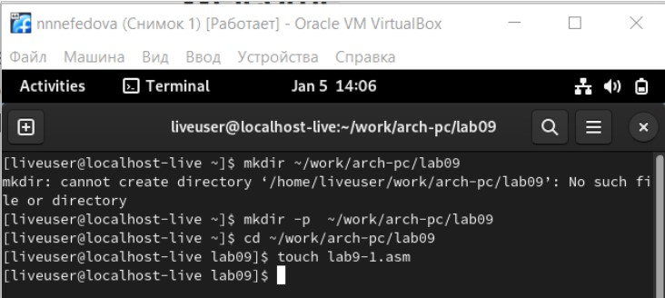{ #fig:001 width=70% }

Введем в файл lab9-1.asm текст программы из листинга 9.1. Создадим исполняемый файл и проверим его работу. Данный пример показывает, что использование регистра ecx в теле цикла loop может привести к некорректной работе программы. Изменим текст программы добавив изменение значение регистра ecx в цикле. (рис. [-@fig:002]), (рис. [-@fig:003])

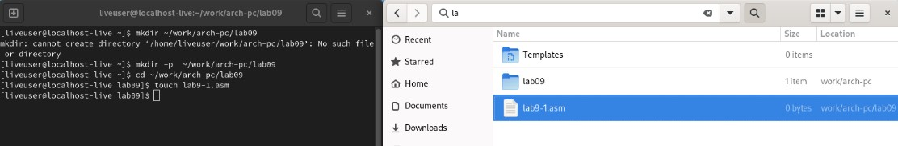{ #fig:002 width=70% }

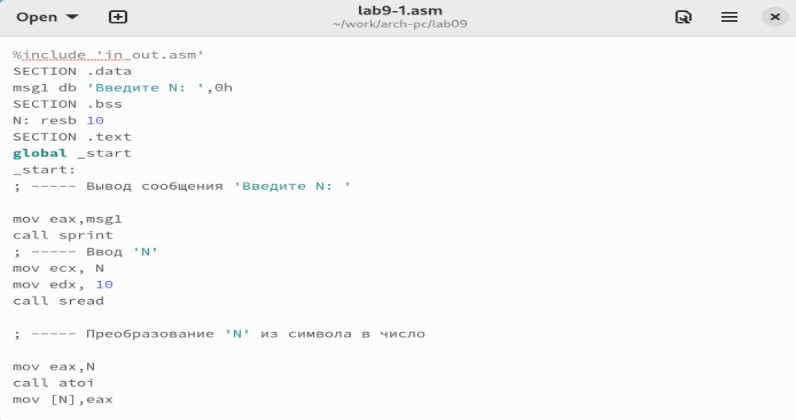{ #fig:003 width=70% }

Установим Nasm: (рис. [-@fig:004]), (рис. [-@fig:005]), (рис. [-@fig:006]), (рис. [-@fig:007])

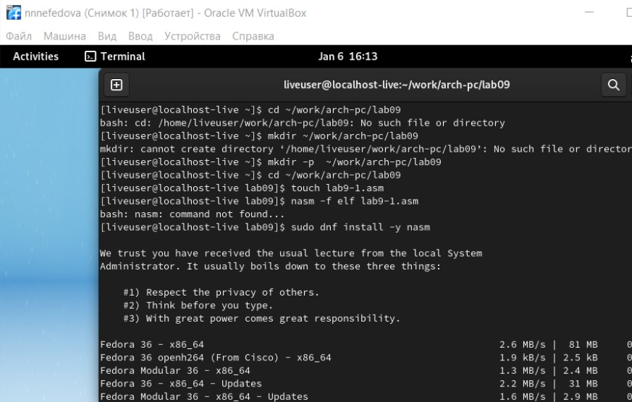{ #fig:004 width=70% }

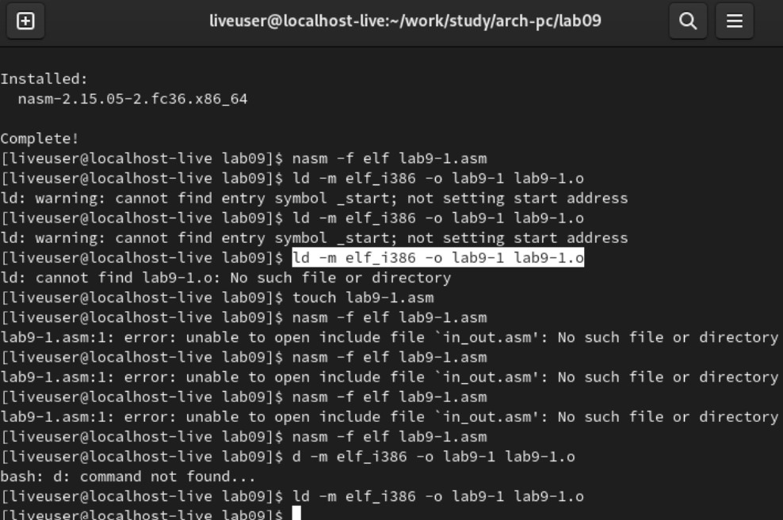{ #fig:005 width=70% }

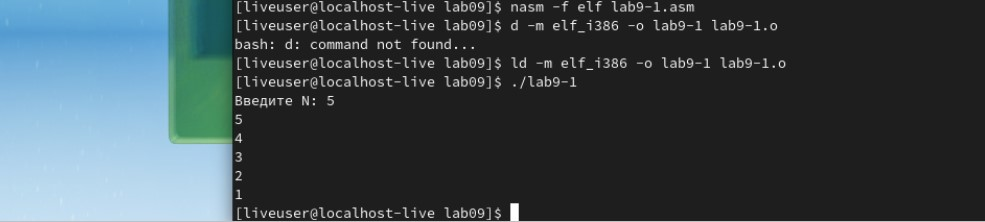{ #fig:006 width=70% }

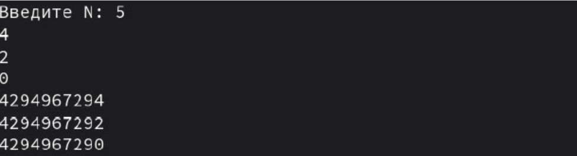{ #fig:007 width=70% }

Для использования регистра ecx в цикле и сохранения корректности работы программы можно использовать стек. Внесем изменения в текст программы добавив команды push и pop (добавления в стек и извлечения из стека) для сохранения значения счетчика цикла loop: (рис. [-@fig:008])

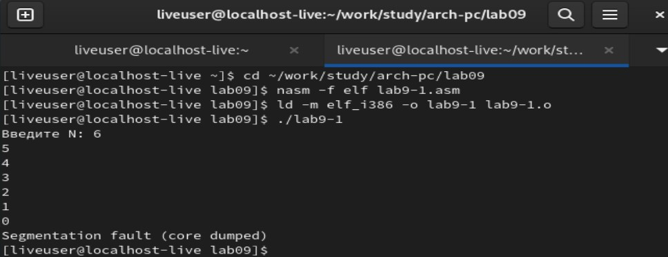{ #fig:008 width=70% }

## Обработка аргументов командной строки

Создадим файл lab9-2.asm в каталоге ~/work/arch-pc/lab09 и введем в него текст программы из листинга 9.2. Создадим исполняемый файл и запустим его, указав аргументы (рис. [-@fig:009]), (рис. [-@fig:010])

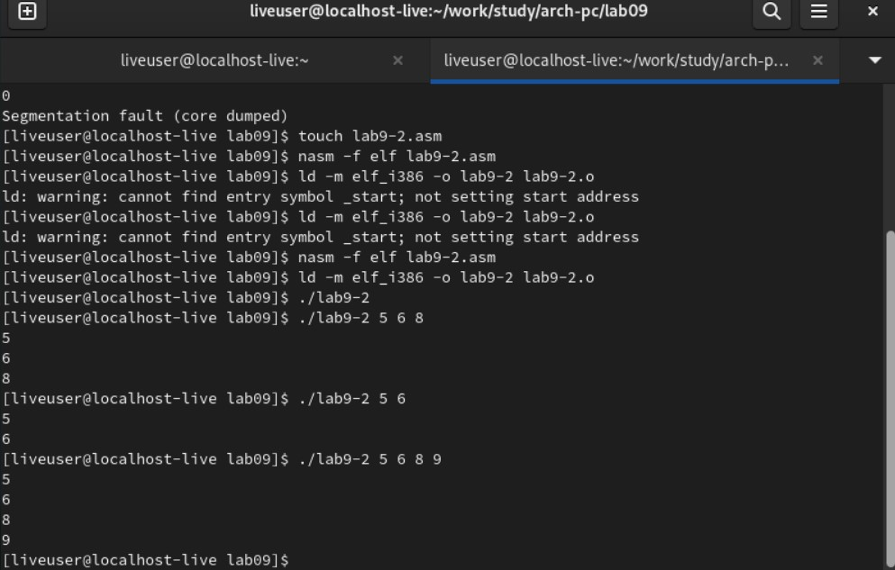{ #fig:009 width=70% }

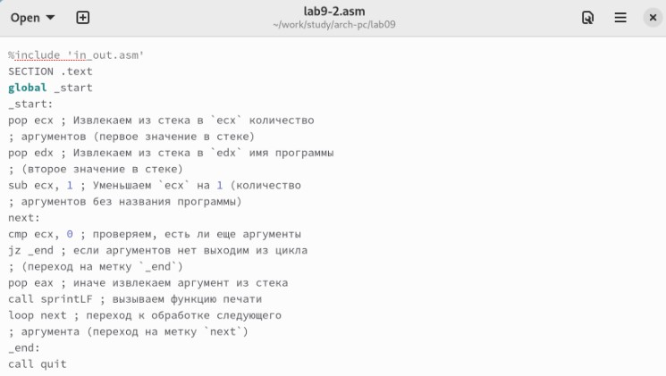{ #fig:010 width=70% }

## Листинг 9.3. Программа вычисления суммы аргументов командной строки

(рис. [-@fig:011]), (рис. [-@fig:012])

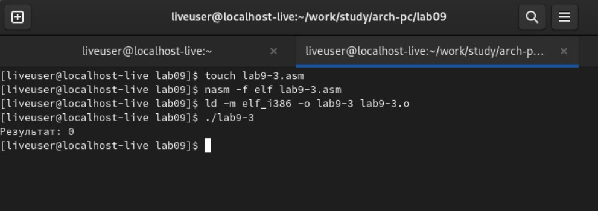{ #fig:011 width=70% }

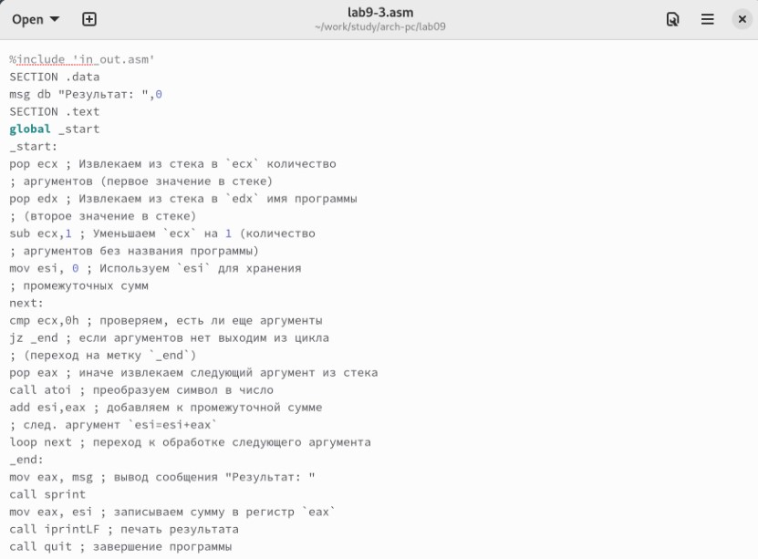{ #fig:012 width=70% }

Проверим работу программы и увидим, что она работает верно. (рис. [-@fig:013])

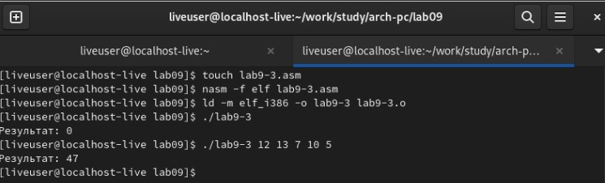{ #fig:013 width=70% }

## Задание для самостоятельной работы

Напишем программу, которая находит сумму значений функции. Значения передаются как аргументы. Создадим исполняемый файл и проверим его работу на нескольких наборах: (рис. [-@fig:014]), (рис. [-@fig:015]), (рис. [-@fig:016])

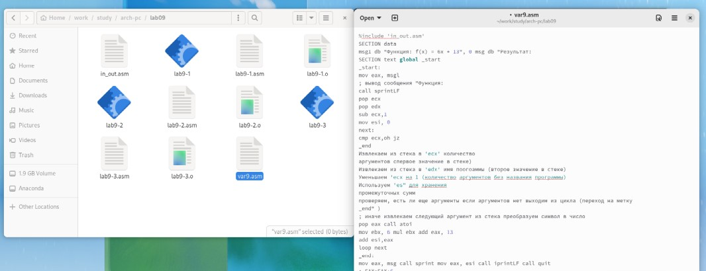{ #fig:014 width=70% }

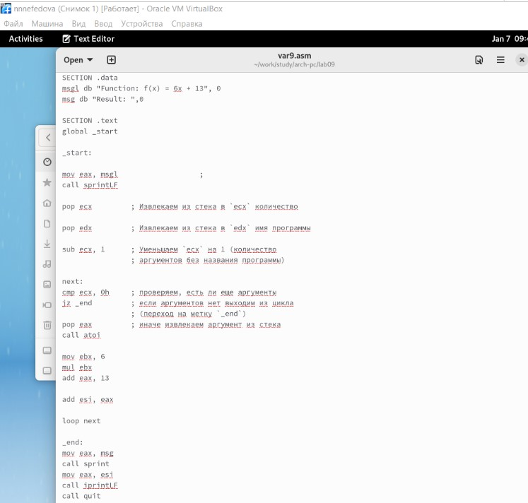{ #fig:015 width=70% }

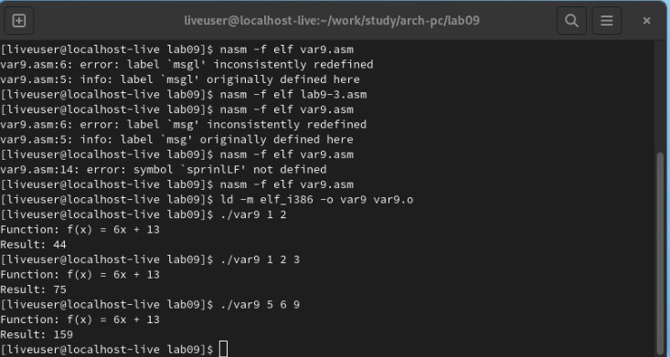{ #fig:016 width=70% }

# Выводы

В ходе данной работы были приобретены навыки написания программ с использованием циклов и обработкой аргументов командной строки.

