---
## Front matter
title: "Отчёт по лабораторной работе №10"
author: "Нефёдова Наталия Николаевна"

## Generic otions
lang: ru-RU
toc-title: "Содержание"

## Bibliography
bibliography: bib/cite.bib
csl: pandoc/csl/gost-r-7-0-5-2008-numeric.csl

## Pdf output format
toc: true # Table of contents
toc-depth: 2
lof: true # List of figures
fontsize: 12pt
linestretch: 1.5
papersize: a4
documentclass: scrreprt
## I18n polyglossia
polyglossia-lang:
  name: russian
  options:
	- spelling=modern
	- babelshorthands=true
polyglossia-otherlangs:
  name: english
## I18n babel
babel-lang: russian
babel-otherlangs: english
## Fonts
mainfont: PT Serif
romanfont: PT Serif
sansfont: PT Sans
monofont: PT Mono
mainfontoptions: Ligatures=TeX
romanfontoptions: Ligatures=TeX
sansfontoptions: Ligatures=TeX,Scale=MatchLowercase
monofontoptions: Scale=MatchLowercase,Scale=0.9
## Biblatex
biblatex: true
biblio-style: "gost-numeric"
biblatexoptions:
  - parentracker=true
  - backend=biber
  - hyperref=auto
  - language=auto
  - autolang=other*
  - citestyle=gost-numeric
## Pandoc-crossref LaTeX customization
figureTitle: "Рис."
tableTitle: "Таблица"
listingTitle: "Листинг"
lofTitle: "Список иллюстраций"
lotTitle: "Список таблиц"
lolTitle: "Листинги"
## Misc options
indent: true
header-includes:
  - \usepackage{indentfirst}
  - \usepackage{float} # keep figures where there are in the text
  - \floatplacement{figure}{H} # keep figures where there are in the text
---

# Цель работы

Приобретение навыков написания программ с использованием подпрограмм. Знакомство с методами отладки при помощи GDB и его основными возможностями.

# Выполнение лабораторной работы

## Реализация подпрограмм в NASM 1. 

Создадим каталог для выполнения лабораторной работы № 10, перейдем в него и создадим файл lab10-1.asm (рис. [-@fig:001])

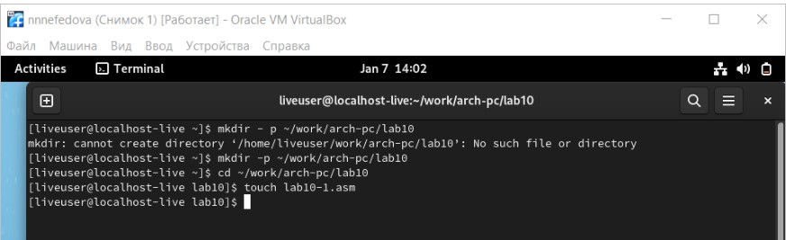{ #fig:001 width=70% }

## Пример программы с использованием вызова подпрограммы 

Рассмотрим программу с использованием вызова подпрограммы(рис. [-@fig:002]), (рис. [-@fig:003])

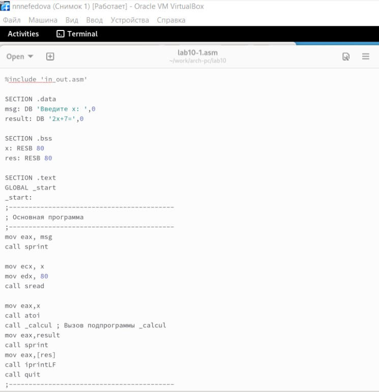{ #fig:002 width=70% }

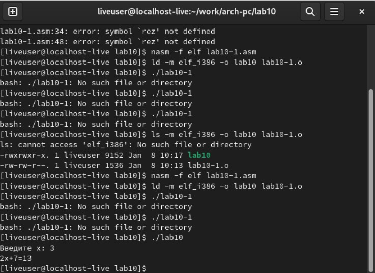{ #fig:003 width=70% }

Первые строки программы отвечают за вывод сообщения на экран (call sprint), чтение данных введенных с клавиатуры (call sread) и преобразования введенных данных из символьного вида в численный (call atoi).
После следующей инструкции call _calcul, которая передает управление подпрограмме _calcul, будут выполнены инструкции подпрограммы:
mov ebx,2
mul ebx
add eax,7
mov [rez],eax
ret

Инструкция ret является последней в подпрограмме и ее исполнение приводит к возвращению в основную программу к инструкции, следующей за инструкцией call, которая вызвала данную подпрограмму.
Последние строки программы реализую вывод сообщения (call sprint), результата вычисления (call iprintLF) и завершение программы (call quit).
Проверим работу программы и выведем результат на экран.

Изменим текст программы, добавив подпрограмму _subcalcul в подпрограмму_calcul, для вычисления выражения f(g(x)), где x вводится с клавиатуры, f(x) = 2x+ 7, g(x) = 3x − 1. Т.е. x передается в подпрограмму _calcul, из нее подпрограмму_subcalcul, где вычисляется выражение g(x), результат возвращается в _calcul и вычисляется выражение f(g(x)). Результат возвращается в основную программу для вывода результата на экран. (рис. [-@fig:004])

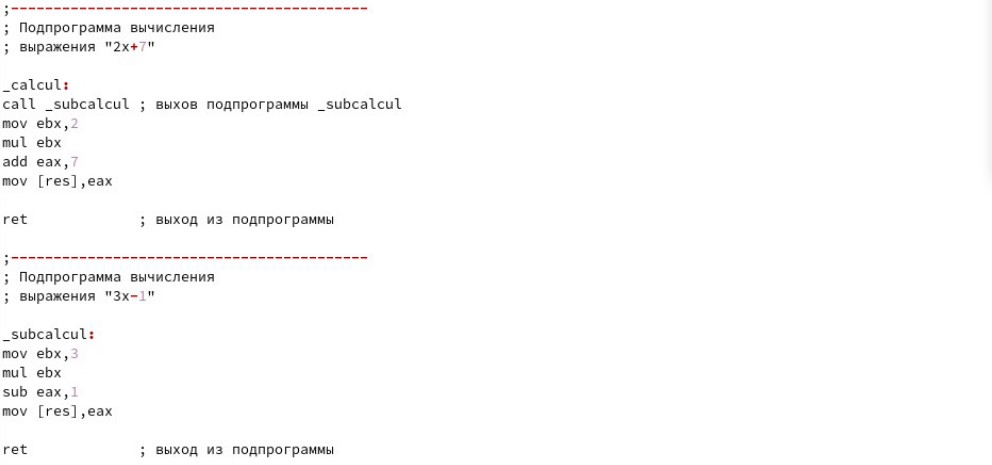{ #fig:004 width=70% }

## Отладка программам с помощью GDB

Создадим файл lab10-2.asm с текстом программы из Листинга 10.2. (Программа печати сообщения Hello world!): Листинг 10.2. Программа вывода сообщения Hello world! (рис. [-@fig:005]), (рис. [-@fig:006])

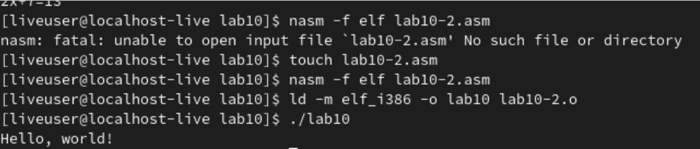{ #fig:005 width=70% }

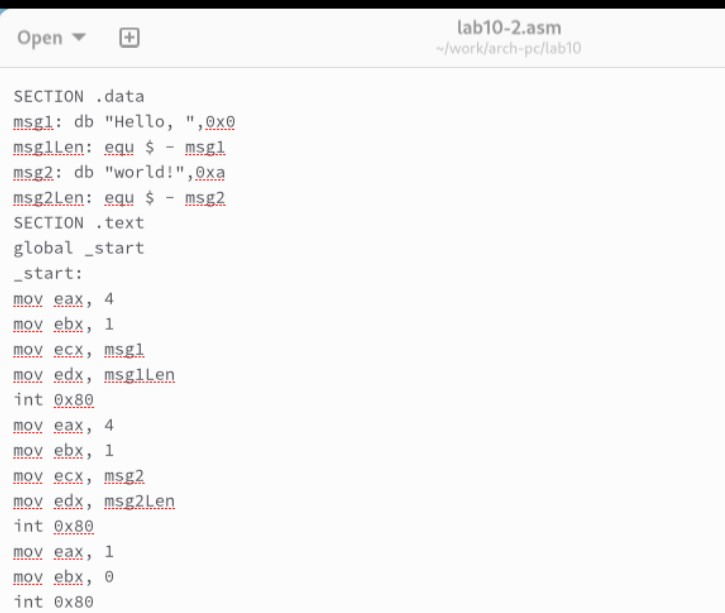{ #fig:006 width=70% }

Получим исполняемый файл. Для работы с GDB в исполняемый файл необходимо добавить отладочную информацию, для этого трансляцию программ необходимо проводить с ключом ‘-g’. nasm -f elf -g -l lab10-2.lst lab10-2.asm ld -m elf_i386 -o lab10-2 lab10-2.o Загрузим исполняемый файл в отладчик gdb: (рис. [-@fig:007])

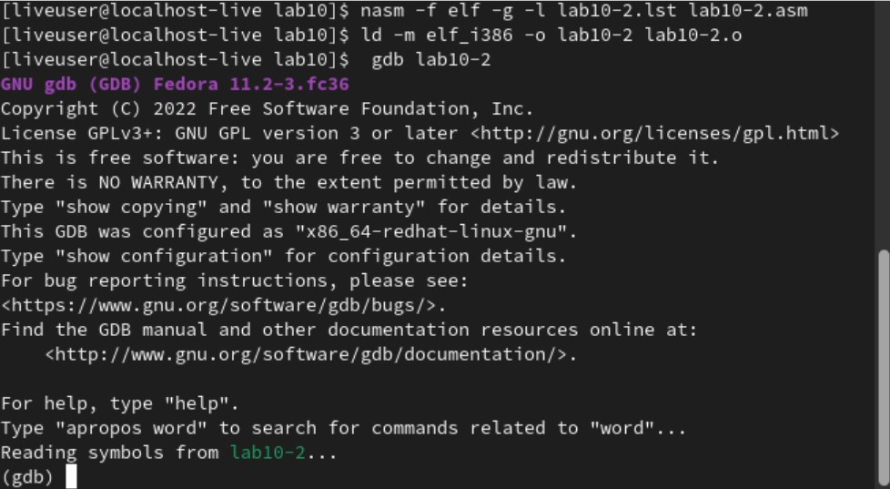{ #fig:007 width=70% }

Проверим работу программы, запустив ее в оболочке GDB с помощью команды run (сокращённо r) (рис. [-@fig:008]), (рис. [-@fig:009])

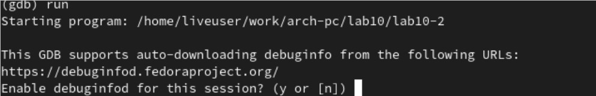{ #fig:008 width=70% }

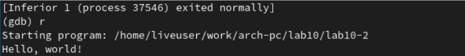{ #fig:009 width=70% }

Для более подробного анализа программы установим брейкпоинт на метку _start, с которой начинается выполнение любой ассемблерной программы, и запустим её. (рис. [-@fig:010]), (рис. [-@fig:011])

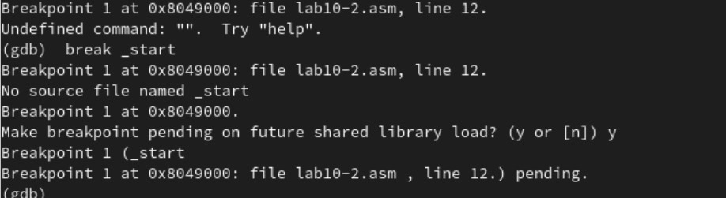{ #fig:010 width=70% }

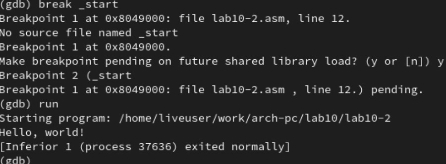{ #fig:011 width=70% }

Посмотрим дисассимилированный код программы с помощью команды disassemble начиная с метки _start (рис. [-@fig:012])

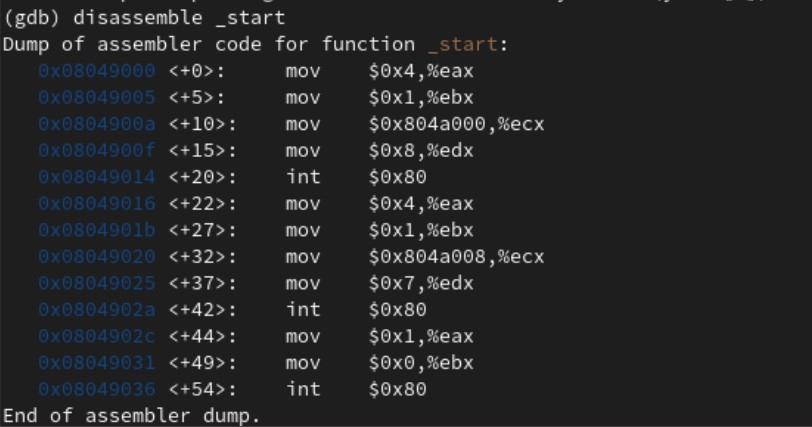{ #fig:012 width=70% }

Переключимся на отображение команд с Intel’овским синтаксисом, введя команду set disassembly-flavor intel (gdb) set disassembly-flavor intel (gdb) disassemble _start (рис. [-@fig:013])

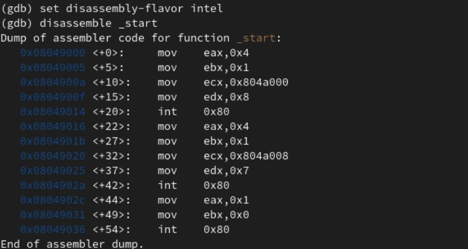{ #fig:013 width=70% }

В этом режиме есть три окна: - В верхней части видны названия регистров и их текущие значения; - В средней части виден результат дисассимилирования программы; - Нижняя часть доступна для ввода команд. (рис. [-@fig:014])

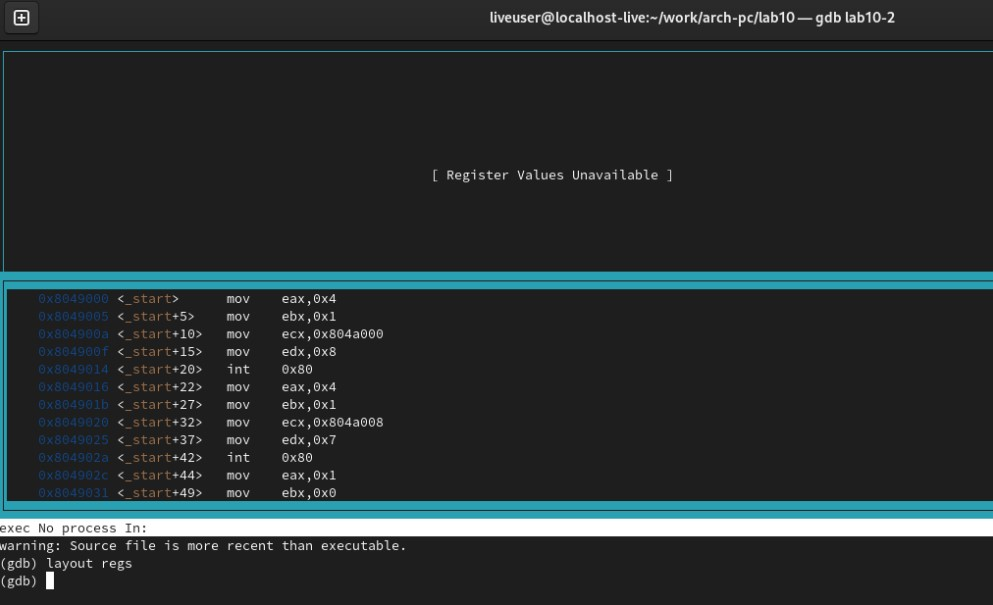{ #fig:014 width=70% }

## Добавление точек останова 

Установить точку останова можно командой break (кратко b). Типичный аргумент этой команды — место установки. Его можно задать или как номер строки программы (имеет смысл, если есть исходный файл, а программа компилировалась с информацией об отладке), или как имя метки, или как адрес. Чтобы не было путаницы с номерами, перед адресом ставится «звёздочка»: На предыдущих шагах была установлена точка останова по имени метки (_start). Проверим это с помощью команды info breakpoints (кратко i b): (gdb) info breakpoints. (рис. [-@fig:015])

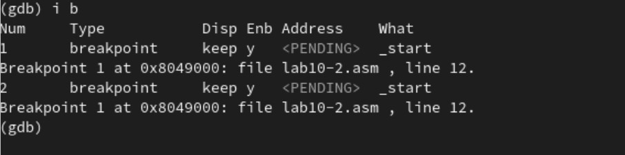{ #fig:015 width=70% }

## Работа с данными программы в GDB 

Отладчик может показывать содержимое ячеек памяти и регистров, а при необходимости позволяет вручную изменять значения регистров и переменных. Выполним 5 инструкций с помощью команды stepi (или si) и проследим за изменением значений регистров. Посмотреть содержимое регистров также можно с помощью команды info registers (или i r). (gdb) info registers (рис. [-@fig:016])

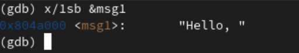{ #fig:016 width=70% }

Посмотрите значение переменной msg2 по адресу. (рис. [-@fig:017])

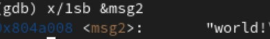{ #fig:017 width=70% }

Изменить значение для регистра или ячейки памяти можно с помощью команды set, задав ей в качестве аргумента имя регистра или адрес. При этом перед именем регистра ставится префикс $, а перед адресом нужно указать в фигурных скобках тип данных (размер сохраняемого значения; в качестве типа данных можно использовать типы языка Си). Изменим первый символ переменной msg1. (рис. [-@fig:018])

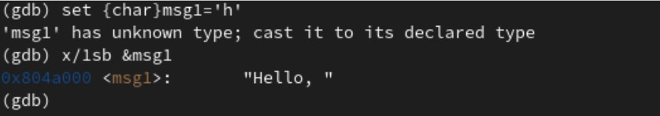{ #fig:018 width=70% }

Заменим второй символ в переменной msg2 (рис. [-@fig:019])

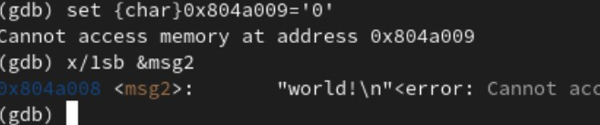{ #fig:019 width=70% }

Чтобы посмотреть значения регистров используется команда print /F (перед именем регистра обязательно ставится префикс $.

Завершим выполнение программы с помощью команды continue (сокращенно c) и выйдем из GDB с помощью команды quit (сокращенно q).

## Обработка аргументов командной строки в GDB

Скопируем файл lab9-2.asm, созданный при выполнении лабораторной работы №9, с программой выводящей на экран аргументы командной строки в файл с именем lab10-3.asm и создадим исполняемый файл. (рис. [-@fig:020])

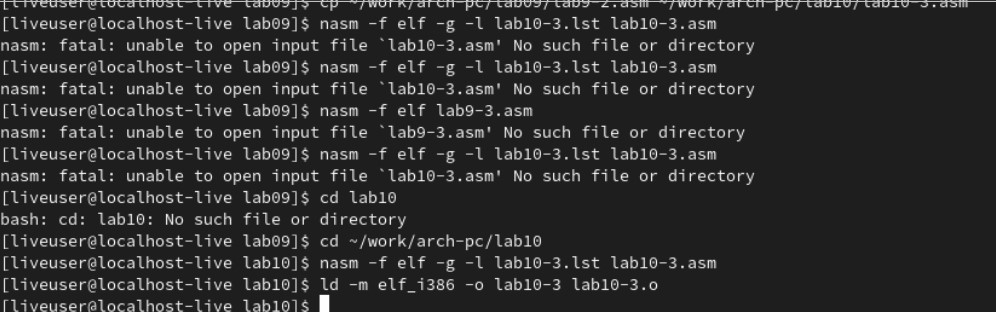{ #fig:020 width=70% }

Как отмечалось в предыдущей лабораторной работе, при запуске программы аргументы командной строки загружаются в стек. Для начала установим точку останова перед первой инструкцией в программе и запустим ее. (рис. [-@fig:021])

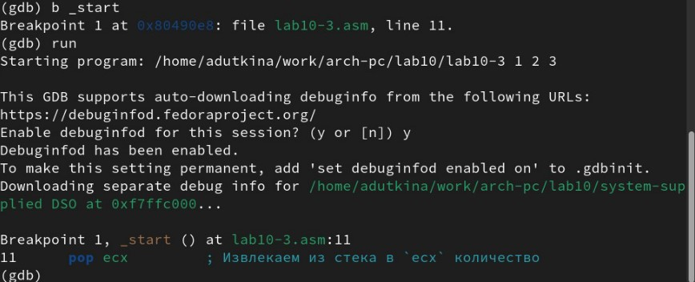{ #fig:021 width=70% }

Адрес вершины стека храниться в регистре esp и по этому адресу располагается число равное количеству аргументов командной строки (включая имя программы). Как видно, число аргументов равно 4 - расположение программы и три аргумента.

Посмотрим остальные позиции стека – по адесу [esp+4] располагается адрес в памяти где находиться имя программы, по адесу [esp+8] храниться адрес первого аргумента, по аресу [esp+12] – второго и т.д. 

## Задание для самостоятельной работы 

1. Преобразуем программу из лабораторной работы №9 (Задание №1 для самостоятельной работы), реализовав вычисление значения функции f(x) как подпрограмму.

2. В листинге 10.3 приведена программа вычисления выражения (3+2)*4+5. При запуске данная программа дает неверный результат. Проверим это. С помощью отладчика GDB, анализируя изменения значений регистров, определим ошибку и исправим ее. (рис. [-@fig:022]), (рис. [-@fig:023]), (рис. [-@fig:024])

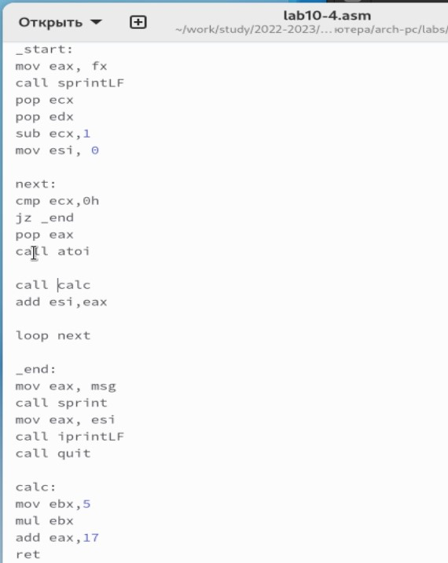{ #fig:022 width=70% }

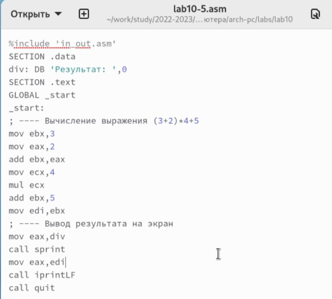{ #fig:023 width=70% }

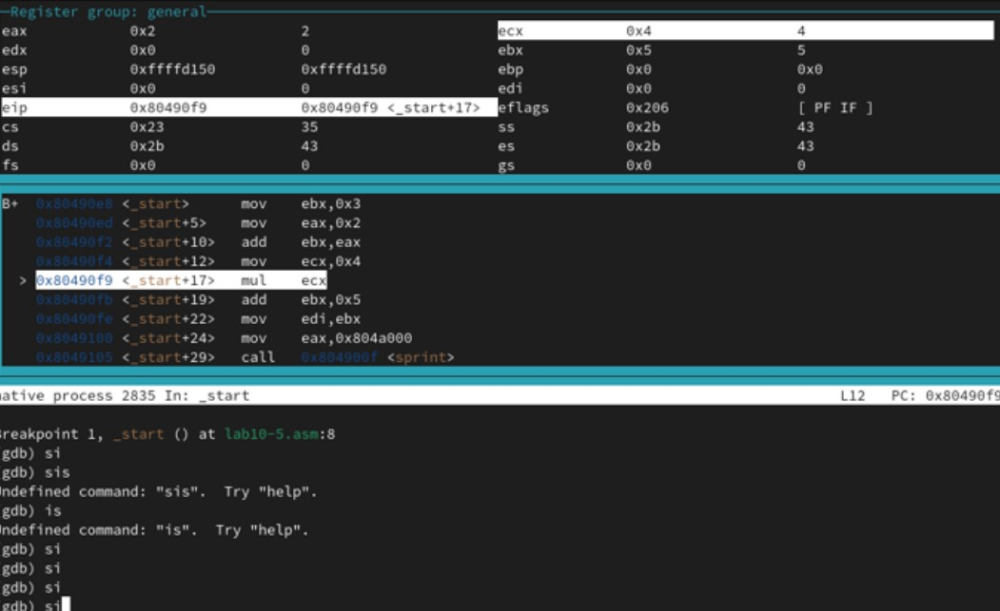{ #fig:024 width=70% }

Отметим, что перепутан порядок аргументов у инструкции add и что по окончании работы в edi отправляется ebx вместо eax (рис. [-@fig:025])

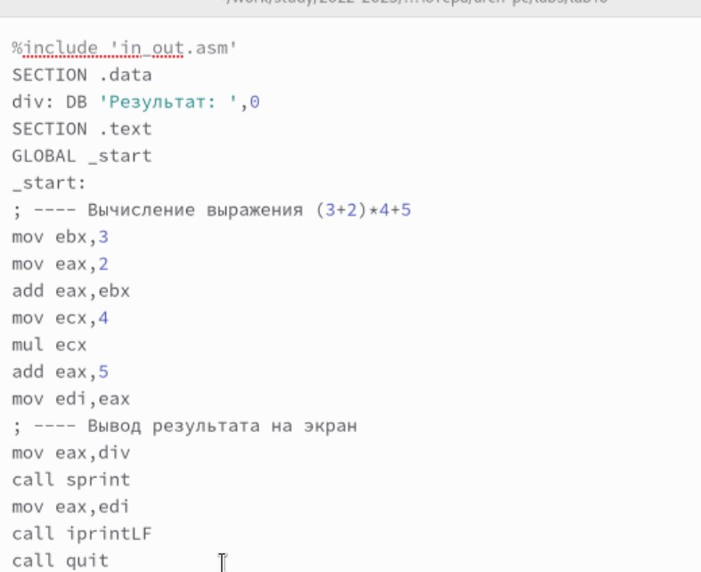{ #fig:025 width=70% }

# Выводы

В ходе лабораторной работы были приобретены навыки написания программ
с использованием подпрограмм и изучены методы отладки при помощи GDB и
его основные возможности

